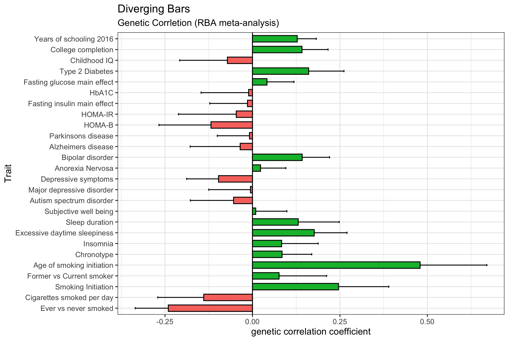

# Genetic_Correlation
LD score regression and GCTA-GREML.  

## Prep summary stats
*merged_ldsc_snp.ls* is a file matching hg19 chr:bp to rs-IDs, with effect and reference alleles based on minor vs major alleles. (Downloadable here)

```R
require(data.table)
setwd("~/Desktop/Projects/GWAS/USED_IN_ANALYSIS/")

data1 = fread("LBD_cutDown.tab")
data2 = fread("merged_ldsc_snp.ls")

colnames(data1) = c("ID", "CHROM", "POS", "ALT", "REF", "A1_FREQ", "A1_CASE_FREQ", "A1_CTRL_FREQ", "Zscore", "Effect", "SE", "P")
colnames(data2) <- c("MarkerName", "SNP", "eff", "ref")

data1$markerID <- paste(data1$CHROM,data1$POS, sep = ":")
data1$A1 <- ifelse(data1$A1_FREQ <= 0.5, as.character(data1$ALT), as.character(data1$REF))
data1$A2 <- ifelse(data1$A1_FREQ <= 0.5, as.character(data1$REF), as.character(data1$ALT))
data1$beta <- ifelse(data1$A1_FREQ <= 0.5, data1$Effect, dat$Effect*-1)
data1$maf <- ifelse(data1$A1_FREQ <= 0.5, data1$A1_FREQ, 1 - data1$A1_FREQ)
data1$merge <- paste(data1$CHROM,data1$POS,data1$A1,data1$A2, sep = ":")

data2$merge = paste(data2$MarkerName,data2$eff,data2$ref,sep = ":")

mg = merge(data1, data2, by="merge", all.x=FALSE)
tab = mg[,c("SNP", "A1", "A2", "Zscore", "P", "merge")]

write.table(tab,file=paste("toLDSC_LBD_sonja.tab"), quote = F, sep = "\t", row.names = F)
````
## Ensure compatibility between summary stats
Use python2, it doesn't work with python 3 :/  
w_hm3.snplist can be downloaded from (ADD)  

````
/usr/bin/python2.7 munge_sumstats.py \
--sumstats toLDSC_LBD_sonja.tab \
--N 9447 \
--out irbd \
--merge-alleles w_hm3.snplist

/usr/bin/python2.7 munge_sumstats.py \
--sumstats toLDSC-iRBD.tab \
--N 9447 \
--out pdwrbd \
--merge-alleles w_hm3.snplist
````

## Run genetic correlation (LD score regression)
````
/usr/bin/python2.7 ldsc.py \
--rg irbd.sumstats.gz,pdwrbd.sumstats.gz \
--ref-ld-chr eur_w_ld_chr/ \
--w-ld-chr eur_w_ld_chr/ \
--out irbd_pdwrbd
````

*The file with the results will be irbd_pdwrbd.log.* 

## Run on LDHub
Alternatively (or additionally), you can upload your summary statistics to http://ldsc.broadinstitute.org/ldhub/ and run genetic correlation using their bank of summary statistics. I did so for the groups which have either been associated to synucleinopathies in the past, or pertain to sleep:  
* fill in
* fill in
* fill in  
etc

## Plot results 
### Set up
```R
require(ggplot2)
require(gridExtra)
require(dplyr)
require(tidyr)
```
### Graph: Diverging Bars

```R
meta <- read.csv("~/Desktop/Projects/GWAS/LD_regression/meta-graph-ldsc.csv", header=T)
meta$categ <- ifelse(meta$rg < 0, "below", "above")

m <- ggplot(meta, aes(x=factor(trait2, levels=rev(unique(trait2)), ordered=TRUE), y=rg, label=rg)) + 
  geom_bar(stat='identity', aes(fill=categ, group=Level), width=.6, color = "black")  +
  scale_fill_manual(#name="Correlation", 
    #labels = c("Positive", "Negative"), 
    values = c("above"="#00ba38", "below"="#f8766d")) + 
  labs(subtitle="Genetic Corrletion (RBA meta-analysis)", 
       title= "Diverging Bars") + 
  theme(legend.position = "none") +
  geom_errorbar(aes(x=trait2, ymin=ifelse(rg>0,rg,rg-se), 
                    ymax=ifelse(rg>0,rg+se,rg)), width=0.2, 
                colour="black", alpha=1, size=0.5) +
  geom_hline(yintercept=0, color="black", size = 0.5) +
  coord_flip() +
  labs(x="Trait", y="genetic correlation coefficient") 
m
```


**NOTE:** From here, I am planning to manually add in the category names for each grouping of the diverging bars plot (e.g. Smoking, Education, etc). I have not been able to find a way to do this in R. 
